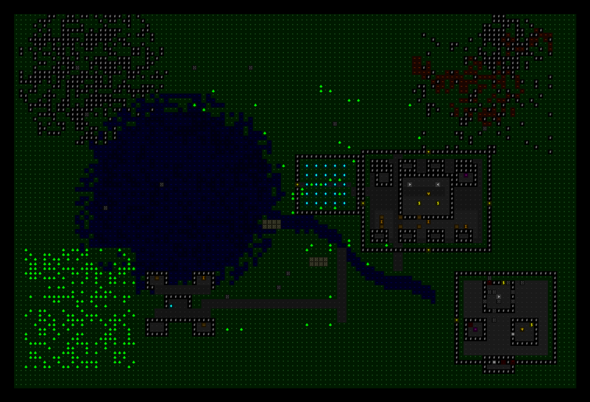
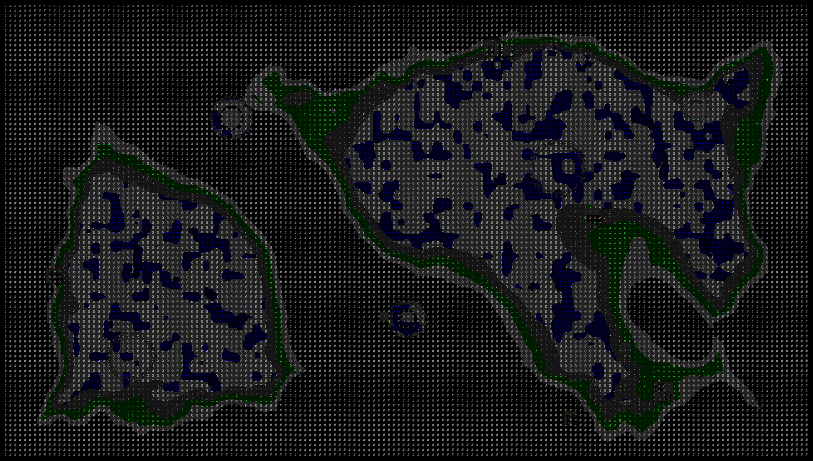
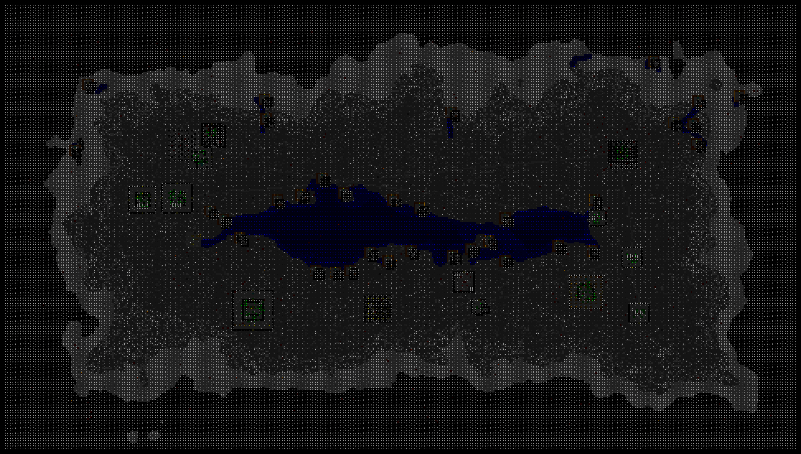
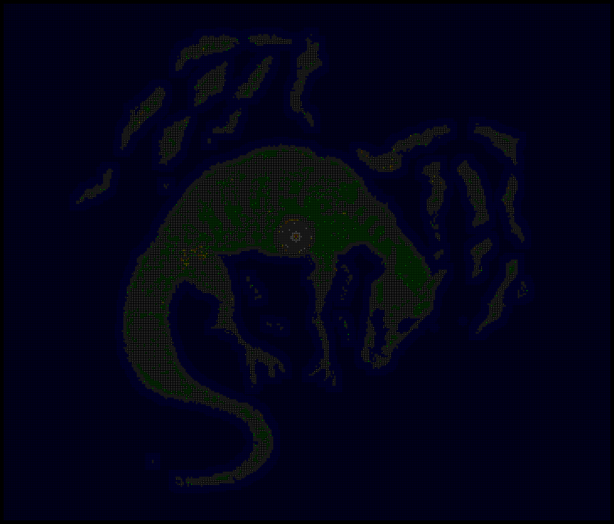

<p align="center">
  
</p>

<h1 align="center">GlyphWeave</h1>

<p align="center">
  <em>An infinite-canvas ASCII roguelike tilemap editor. Paint dungeons, weave glyphs.</em>
</p>

<p align="center">
  <a href="https://github.com/HsiangNianian/GlyphWeave"></a>
  <a href="https://github.com/HsiangNianian/GlyphWeave/blob/main/LICENSE"></a>
  <a href="https://glyphweave.hydroroll.team"></a>
  <br>
  
  
  
  
  
  
  
  <br>
  
  
</p>

<p align="center">
  <b>English</b> · <a href="README.zh.md">中文</a> · <a href="README.ja.md">日本語</a>
</p>

---

## What Is This

**GlyphWeave** is an open-source, infinite-canvas tilemap editor designed for roguelike ASCII art. Paint dungeons tile by tile, place preset rooms, switch between retro terminal themes, and export your worlds as portable `.gemap` files — all in the browser.

Each tile is an ASCII glyph (`#`, `.`, `~`, `♣`, …). **Weave** them into a coherent map, strand by strand.

---

## Two Implementations

GlyphWeave ships in two forms that share the same `.gemap` map format:

| | Web app | Desktop app |
|---|---|---|
| Path | `src/` | `bevy/` |
| Stack | React 19, Konva, Tailwind, Zustand | Rust, Bevy 0.18, `bevy_ecs_tilemap`, `bevy_egui` |
| Runs in | Browser | Native desktop + browser WASM preview |
| Status | Full feature set (production) | In progress — editor, gameplay simulation, and WASM preview available |

The Bevy port is the active development direction (desktop-first, heading toward a real-time simulation/lighting engine). The React app remains the reference for behavior and visuals. See [docs/superpowers/specs/](docs/superpowers/specs/) for the phased plan.

---

## Features

- **Infinite canvas** — pan and zoom with Konva. Middle-click or Pan tool to navigate.
- **25 tile types** — walls, floors, water, lava, trees, furniture, decorations, and more.
- **25 preset rooms** — rooms, corridors, dungeon features, traps, ready to place.
- **Dual themes** — ANSI 16 (classic terminal) and Cogmind Dark (cyberpunk low-light). Switching theme instantly recolors every tile.
- **Multi-layer editing** — separate Terrain, Structures, and Details onto different layers. Hide, lock, add, or delete layers freely.
- **Brush / Eraser / Flood Fill / Pan / Select** tools.
- **Undo / Redo** (Ctrl+Z / Ctrl+Shift+Z) — step back through your last 50 edits.
- **Export / Import** as `.gemap` v3 ZIP — sparse 3D voxels shared by the web and Bevy runtimes.
- **Minimap** — real-time overview with viewport rectangle. Click to jump.
- **View Distance** — configurable render padding for smooth panning.
- **Render API** — generate PNG/SVG images from any map via `GET /api/render` or `POST /api/render`.
- **Image import** — convert browser-decodable images into theme-matched GlyphWeave maps directly in the app.
- **Convert API** — convert PNG/JPEG/WebP images into theme-matched GlyphWeave maps and SVG output on Node-backed servers.
- **Keyboard shortcuts** — `B` brush, `E` eraser, `F` flood fill, `P` pan, `S` select, `G` grid toggle.
- **Demo maps** — load "The Forgotten Catacombs" or "Grand Realm of Aethra" to explore.

---

## Quick Start

### Web app (React)

```bash
# Install dependencies
pnpm install

# Set up git hooks (commit checks)
git config core.hooksPath .githooks

# Start development server
pnpm dev
```

Open `http://localhost:5173` — choose a world name, tile size, and theme, then start painting. Or click **Load Demo Map** to explore a pre-built dungeon.

### Desktop app (Rust + Bevy)

Requires Rust ≥ 1.89 (edition 2024) and a Vulkan-capable GPU.

```bash
cargo run --manifest-path bevy/Cargo.toml -p glyphweave-app
```

A 1280×720 window opens and auto-loads the Grand Realm of Aethra demo. Left-drag paints the selected tile, the wheel zooms to the cursor, and middle/right-drag pans. The left panel holds the tile palette and theme toggle; the right panel lists layers. Tests: `cargo test --manifest-path bevy/Cargo.toml --workspace`.

> The **Render API** and **Convert API** are available on the same port under `/api/` during development. In production, `pnpm start` serves the frontend plus Node-backed APIs on port 3001. Cloudflare Workers + Assets deployments support rendering and app-side browser image import; direct `/api/convert` remains Node-only.

### Browser preview (Rust + Bevy WASM)

Install the browser target, the matching `wasm-bindgen` CLI, and Binaryen once:

```bash
rustup target add wasm32-unknown-unknown
cargo install wasm-bindgen-cli --version 0.2.126 --locked
brew install binaryen
```

Build and serve the standalone preview:

```bash
pnpm bevy:web:build
pnpm bevy:web:serve
```

Open `http://localhost:8080`. Browser file import/export is intentionally
disabled in this first preview because the native controls use filesystem
paths.

Deploy the TypeScript app and Bevy preview as separate Cloudflare Workers +
Static Assets projects:

```bash
pnpm deploy:web
pnpm deploy:bevy
```

The default `pnpm deploy` command is an alias for `pnpm deploy:web`, so the
production TypeScript app does not include Bevy artifacts. `pnpm deploy:bevy`
builds `bevy/web/dist` and deploys it with `wrangler.bevy.jsonc` under the
separate `glyphweave-bevy` Worker. Its WASM executes in the visitor's browser
while Cloudflare serves the generated files as static assets.

## Keyboard Shortcuts

| Key            | Action      |
| -------------- | ----------- |
| `B`            | Brush tool  |
| `E`            | Eraser tool |
| `F`            | Flood fill  |
| `P`            | Pan tool    |
| `S`            | Select tool |
| `Ctrl+Z`       | Undo        |
| `Ctrl+Shift+Z` | Redo        |
| `G`            | Toggle grid |

---

## Render API

The Render API renders an explicit z slice from a v3 `.gemap` ZIP. Legacy v1/v2
JSON remains accepted as input during a compatibility window. It's available in
three environments:

| Environment | Command | URL | Output |
|---|---|---|---|
| Development | `pnpm dev` | `http://localhost:5173/api/render` | PNG default or SVG (`?format=svg`) |
| Production (Node) | `pnpm build && pnpm start` | `http://localhost:3001/api/render` | PNG default or SVG (`?format=svg`) |
| Production (Cloudflare) | `pnpm deploy` | `https://glyphweave.hydroroll.team/api/render` | SVG |

### POST a v3 `.gemap` ZIP

```bash
curl -X POST "https://glyphweave.hydroroll.team/api/render?z=0" \
  -H "Content-Type: application/vnd.glyphweave.gemap+zip" \
  --data-binary @my-map.gemap > map.svg
```

`application/zip` is also accepted. The signed 32-bit `z` query is mandatory
for v3 so rendering always selects one exact elevation.

### GET (small legacy JSON maps only)

```bash
DATA=$(echo -n '{"tiles":{"0,0":"wall"}}' | base64)
curl "https://glyphweave.hydroroll.team/api/render?data=$DATA" > map.svg
```

Parameters:

- `z` — exact elevation; required for v3 ZIP requests
- `theme` — `ansi-16` (default) or `cogmind`
- `padding` — extra tiles around bounds (default: `1`)
- `scale` — pixels per tile (default: auto-fit ≤ 4096px)
- `format` — `svg` or `png`; PNG requires the Node renderer

### Local / Self-hosted

```bash
pnpm dev                           # dev server, http://localhost:5173
pnpm build && pnpm start           # production, http://localhost:3001

curl -X POST "http://localhost:3001/api/render?z=0" \
  -H "Content-Type: application/vnd.glyphweave.gemap+zip" \
  --data-binary @my-map.gemap > map.png

curl -X POST "http://localhost:3001/api/render?z=-1&format=svg" \
  -H "Content-Type: application/zip" \
  --data-binary @my-map.gemap > map.svg
```

Render and Convert bodies are limited to 16 MiB; legacy Render JSON is limited
to 2 MiB. ZIP parsing additionally bounds entry count, expanded size, per-entry
size, and compression ratio.

---

## Convert API

The Convert API samples an uploaded image into a GlyphWeave map by matching
each output cell to the nearest tile color in the supplied theme.

Cloudflare deployments still support image import in the app and `/api`
Playground by converting in the browser. Direct `/api/convert` requests require
the Node image renderer.

| Environment | Command | URL | Output |
|---|---|---|---|
| Development | `pnpm dev` | `http://localhost:5173/api/convert` | SVG default, PNG, `.gemap`, or JSON bundle |
| Production (Node) | `pnpm build && pnpm start` | `http://localhost:3001/api/convert` | SVG default, PNG, `.gemap`, or JSON bundle |
| Production (Cloudflare) | `pnpm deploy` | `https://glyphweave.hydroroll.team/api/convert` | Not available (`501`) |

`theme` or `themeId` is required because conversion uses the theme palette as
the tile classifier.

```bash
curl -X POST "http://localhost:3001/api/convert?themeId=ansi-16&width=160&format=svg" \
  -H "Content-Type: image/png" \
  --data-binary @input.png > converted.svg
```

Generate a v3 ZIP directly:

```bash
curl -X POST "http://localhost:3001/api/convert?themeId=ansi-16&width=160&format=gemap" \
  -H "Content-Type: image/png" \
  --data-binary @input.png > converted.gemap
```

Multipart uploads can pass a custom theme object:

```bash
curl -X POST "http://localhost:3001/api/convert?width=160&format=both" \
  -F "image=@input.webp" \
  -F "theme=@my-theme.json" > converted.json
```

`format=gemap` returns a binary v3 ZIP with media type
`application/vnd.glyphweave.gemap+zip`. `format=both` returns JSON containing an
SVG plus `gemap: { mediaType, encoding: "base64", data }`; base64-decode
`gemap.data` to recover the exact ZIP bytes.

Parameters:

- `themeId` — built-in theme ID such as `ansi-16` or `cogmind`
- `theme` — custom theme JSON object, or a built-in theme ID alias
- `width` / `height` — output map dimensions; default width is `160`, max side is `512`
- `format` — `svg` (default), `png`, `gemap`, or `both`
- `worldName` — map name in `.gemap` output
- `alphaThreshold` — transparent pixels at or below this alpha become void

---

## Demo Maps

| Map                     | Size   | Description                                                                                                                   |
| ----------------------- | ------ | ----------------------------------------------------------------------------------------------------------------------------- |
| The Forgotten Catacombs | 80×48  | Hand-curated dungeon with 25 preset rooms                                                                                     |
| Grand Realm of Aethra   | 120×80 | A sprawling 3-layer realm with mountains, lake, river, lava fissure, volcano, forest, village, walled city, park, and dungeon |

---

## Gallery

<p align="center">
  
</p>
<p align="center"><em>Grand Realm of Aethra</em></p>

<p align="center">
  
</p>
<p align="center"><em>Badlands Wadi</em></p>

<p align="center">
  
</p>
<p align="center"><em>Dragon Archipelago — traced from reference</em></p>

### Show Off Your Maps

Built a dungeon, town, or wilderness you're proud of? Contributions are welcome — landscapes, themed vignettes, and unusual palettes are all fair game.

1. Render it via `/api/render` (SVG from Cloudflare, PNG from a Node server) or export straight from the editor.
2. Drop the image under `media/` (compress large renders — aim for under ~2 MB).
3. Open a PR adding it to the `## Gallery` section above with a one-line caption.

See [`AGENTS.md`](AGENTS.md) for repo conventions and the PR workflow.

---

## Why the Name?

**Glyph** — each tile is an ASCII glyph (`#`, `.`, `~`, `♣`, …).  
**Weave** — you interlace these glyphs into a coherent map, strand by strand.

---

## License

[](LICENSE)

MIT © Hsiang Nianian
